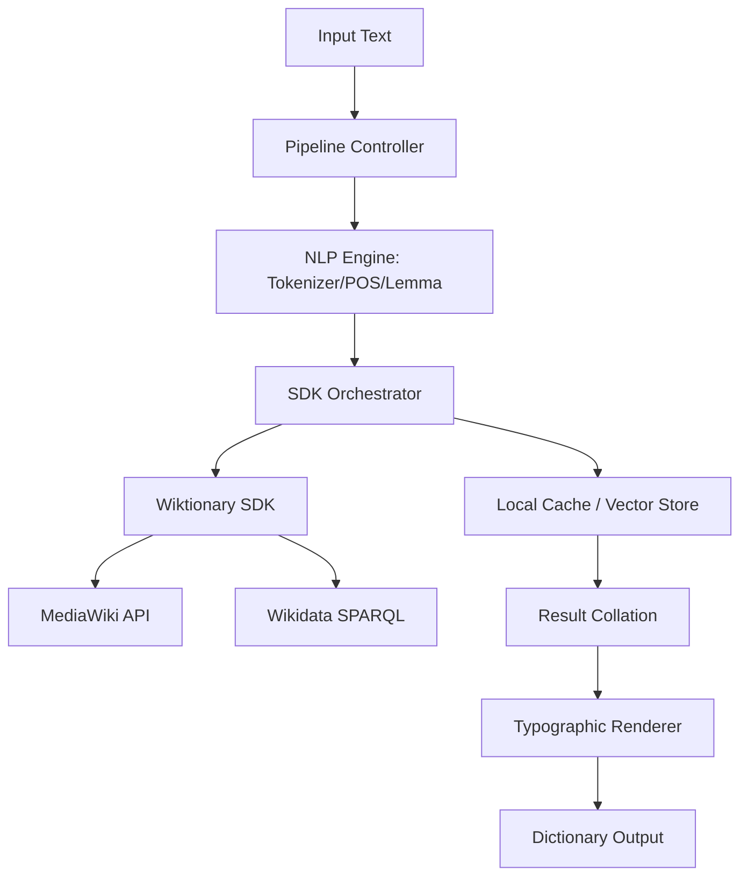

# Text-to-Dictionary Pipeline: Technical Architecture & Implementation Plan

## 1. Vision
The **Text-to-Dictionary (T2D)** application is a high-fidelity linguistic analyzer that transforms arbitrary source text into a comprehensive, lexicographically structured dictionary. Unlike standard translators, T2D focuses on **morphemic transparency** and **semantic depth**, providing the reader with a full academic entry for every unique lemma encountered in the text.

## 2. Core Architecture
The application acts as a "Consumer Layer" built on top of the `wiktionary-sdk` (v2.1.0+).



---

## 3. The 10-Step Pipeline

### Phase I: Decomposition
1.  **Language Identification**: Global detection of source language; fallback to token-level detection for code-switching or loanwords.
2.  **Smart Tokenization**: Identifying multi-word expressions (MWEs) and idiomatic clusters (e.g., "world government", "en vogue") as single tokens.
3.  **Morphological Tagging & Lemmatization**: 
    *   Using NLP libraries (e.g., `spacy`, `wink-nlp`) to identify POS and Grammatical Traits (Gender, Case, Number).
    *   Resolving tokens to their canonical **Dictionary Lemma** (e.g., `ἔγραψε` → `γράφω`).

### Phase II: Acquisition (The SDK Layer)
4.  **Parallel Fetch**: Invoking the `wiktionary-sdk` for each unique lemma to retrieve:
    *   Etymology, Pronunciation, Morphology Paradigms.
    *   Senses, Translations, and Semantic Relations (Synonyms/Antonyms).
    *   Wikidata Enrichment (QIDs, Ontological Parents).
5.  **Sense Disambiguation**: Cross-referencing the context of the input text with the definitions provided by the SDK to identify the *active* sense for each token.
6.  **Media Harvesting**: Collecting structured audio (pronunciation) and images from the SDK's `audios` and `images` arrays.

### Phase III: Synthesis & Formatting
7.  **Token-Instance Mapping**: Collecting every specific morphological form of a lemma found in the input text and grouping them under the main entry.
8.  **Contextual Usage Extraction**: Prioritizing the *original input sentence* as the primary usage sample, followed by the SDK’s literary citations.
9.  **Lexicographical Sorting**: Alphabetical, case-insensitive sorting with support for non-Latin scripts (e.g., Greek, Cyrillic, Hebrew).
10. **Typographic Rendering**: Converting the structured JSON data into the **Gold Standard** CSS specimen (Garamond, Small-Caps labels, justifications).

---

## 4. Proposed Data Structure (`T2DResult`)
The application will extend the SDK's `Entry` interface with contextual markers.

```typescript
interface T2DResult {
  metadata: {
    sourceLanguage: string;
    targetLanguage: string;
    tokenCount: number;
    timestamp: string;
  };
  glossary: {
    [lemma: string]: {
      sdkEntry: Entry; // The full Wiktionary SDK object
      occurrences: {
        raw: string; // The exact text found
        sentence: string; // The context sentence
        traits: MorphologicalTraits; // Case, Number, Gender
      }[];
      activeSenseIndex: number; // Disambiguated sense
    };
  };
}
```

---

## 5. UI/UX Considerations
*   **Split-Screen View**: Original text on the left; interactive, typographic dictionary on the right.
*   **Hover-Sync**: Highlighting a word in the text instantly focuses the corresponding dictionary entry.
*   **Print-Ready Export**: Automatic PDF generation using the academic typography template.
*   **Interactive Etymology**: Clickable arrows (←) in the etymology chain to jump to ancestral lemmas.

## 6. Technology Stack
*   **Framework**: Next.js 14+ (App Router) for Server-Side Rendering of complex layouts.
*   **Styling**: Vanilla CSS with CSS Variables for precise typographic control (Modular Scale).
*   **NLP**: `node-nlp` or `Compromise` for lightweight frontend tokenization; `SpaCy` via microservice for heavy lifting.
*   **SDK**: `wiktionary-sdk` (NPM package).
*   **Fonts**: 
    *   *Serif*: EB Garamond (Body/Academic).
    *   *Sans*: Inter (UI/Metadata).
    *   *Mono*: JetBrains Mono (Transliterations).

---

## 7. Next Steps for Development
1.  **Refine SDK Wrapper**: Ensure `wiktionary-sdk` handles batch requests efficiently with a shared cache.
2.  **Disambiguation Logic**: Implement a basic keyword-matching algorithm for sense resolution.
3.  **Typographic Component**: Formalize the `DictionaryEntry` React component based on the `TYPOGRAPHIC_SPECIMEN.html`.
