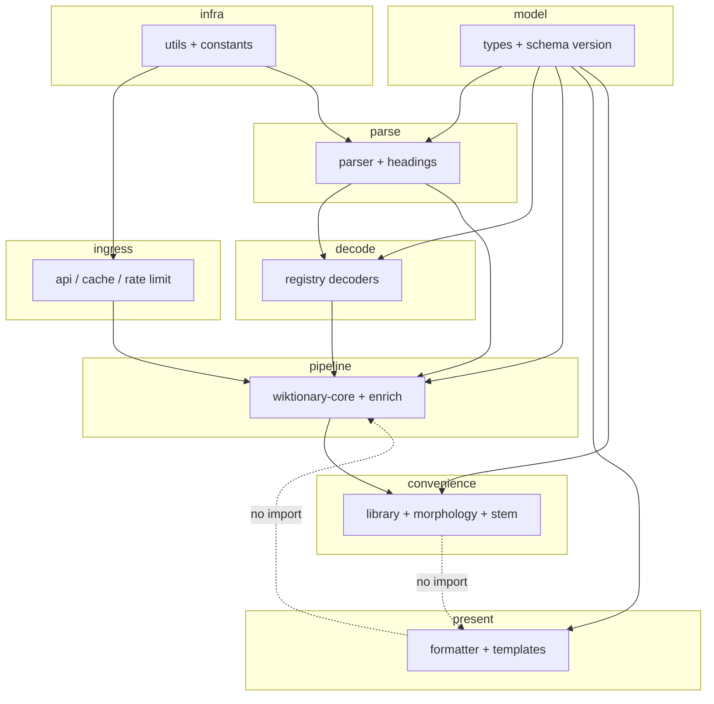

# Source layout: dependency layers

Companion to the staged physical moves in [`src-layout-refactor-plan.md`](src-layout-refactor-plan.md). Folder names express the pipeline: **ingress → parse → decode → pipeline → model → present → convenience**, with **infra** for shared pure helpers.

## Allowed import edges

| Layer         | May import from                         | Must not import from (avoid cycles)        |
|---------------|-----------------------------------------|--------------------------------------------|
| `ingress`     | `infra`, `model`                        | `parse`, `decode`, `pipeline`, `present`, `convenience` |
| `parse`       | `model`, `infra`                        | `decode`, `pipeline`, `convenience`        |
| `decode`      | `model`, `parse`, `infra`               | `pipeline`, `convenience`, `present`       |
| `pipeline`    | below + `decode`, `parse`, `ingress`     | `convenience`, `present`                   |
| `present`     | `model`, `infra`, `parse` (helpers only) | `pipeline`, `convenience`                  |
| `convenience` | `pipeline`, `ingress`, `model`, `infra`, `decode` (if needed) | `present`                    |
| `model`       | (none or `infra` only)                  | everything else                            |

## Flow (high level)

**Note:** `morphology` ↔ `library` cycles are resolved in Phase 8 of the refactor plan (shared helper or inversion).
